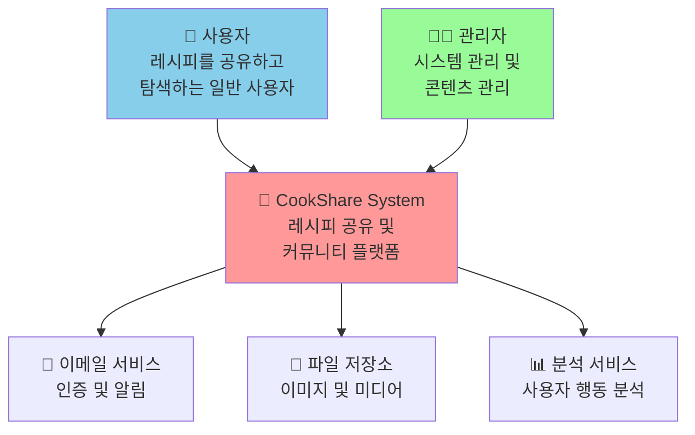
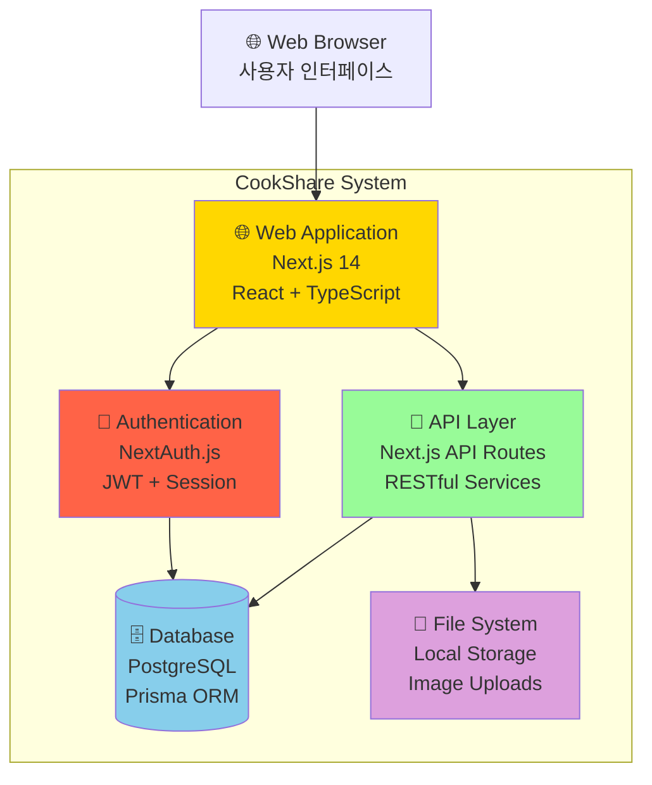
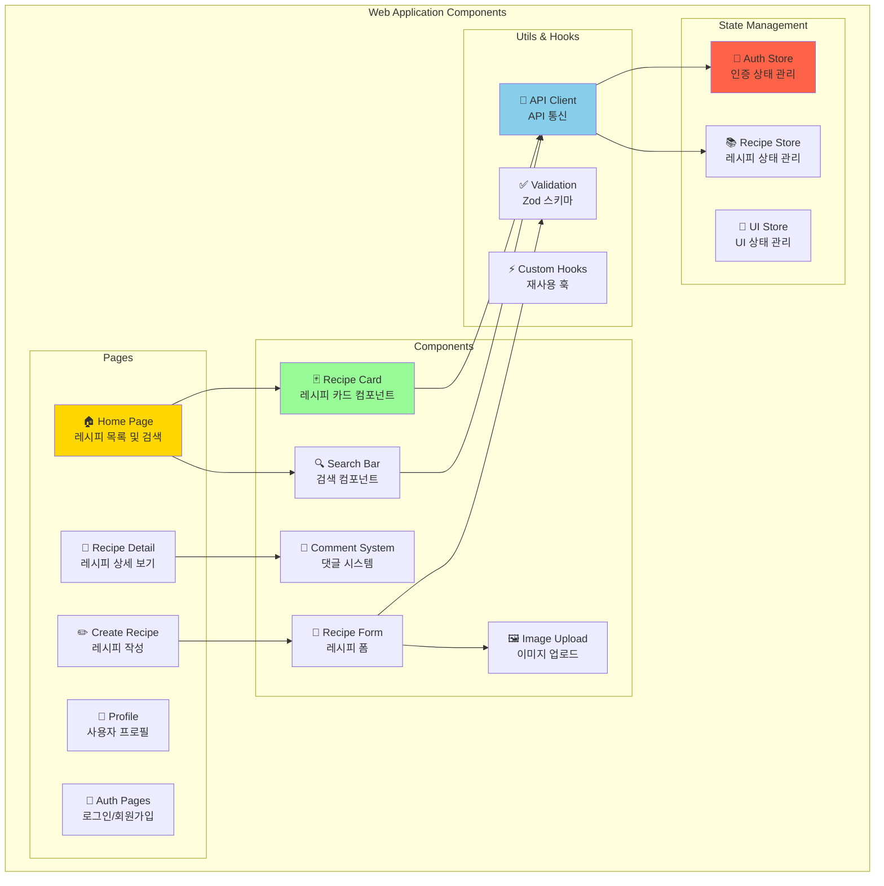
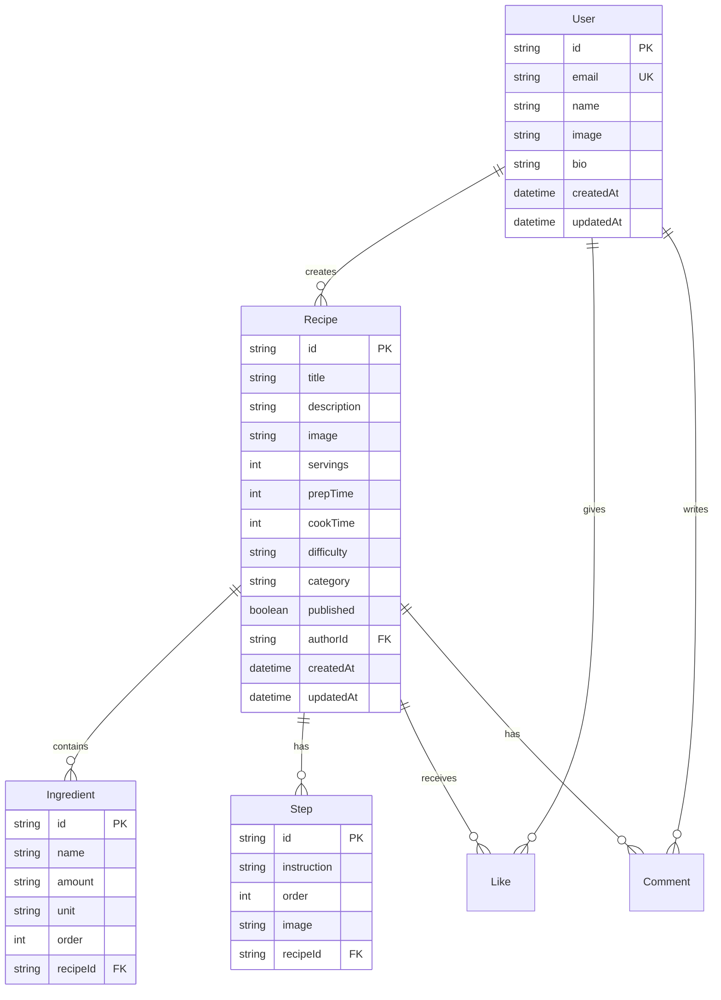
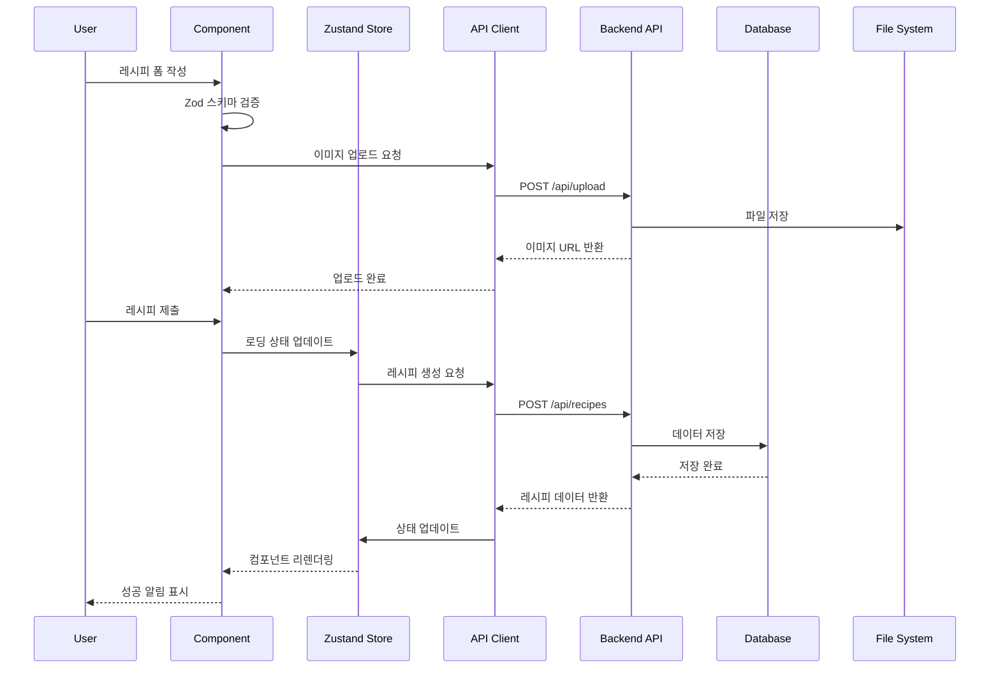
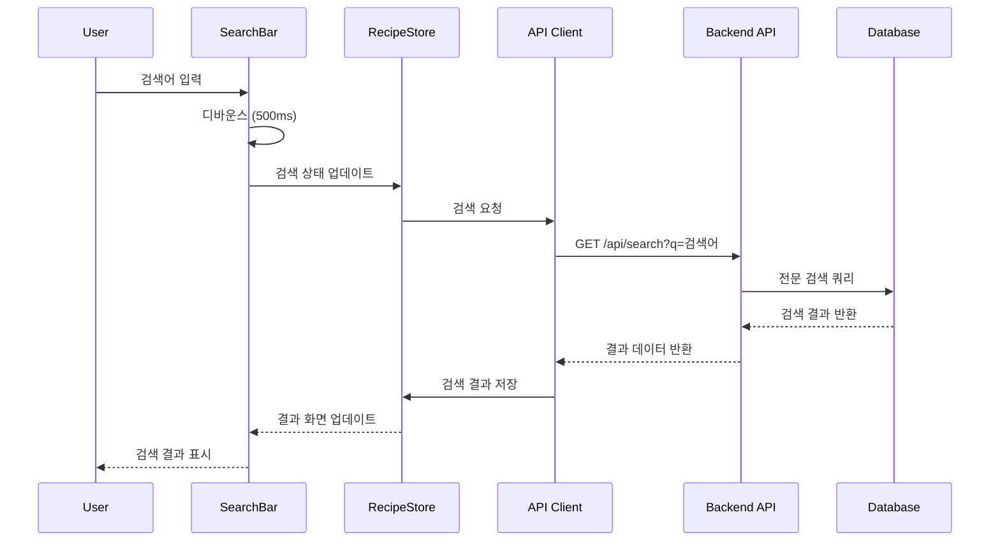

# CookShare 시스템 아키텍처 문서

## 개요

본 문서는 CookShare 레시피 공유 플랫폼의 시스템 아키텍처를 C4 모델(Context, Container, Component, Code)을 사용하여 설명합니다.

## C4 모델 다이어그램

### Level 1: System Context Diagram



#### Context Level 설명

**시스템 사용자**
- **일반 사용자**: 레시피 작성, 검색, 좋아요, 댓글 작성
- **관리자**: 시스템 관리, 부적절한 콘텐츠 관리

**외부 시스템**
- **이메일 서비스**: 회원가입 인증, 알림 발송
- **파일 저장소**: 레시피 이미지 및 프로필 이미지 저장
- **분석 서비스**: 사용자 행동 데이터 수집 및 분석

### Level 2: Container Diagram



#### Container Level 설명

**Web Application (Next.js 14)**
- **기술**: React 18, TypeScript, Tailwind CSS, shadcn/ui
- **역할**: 사용자 인터페이스, 클라이언트 사이드 로직
- **통신**: HTTPS로 API와 통신

**API Layer (Next.js API Routes)**
- **기술**: Next.js API Routes, Zod 검증
- **역할**: 비즈니스 로직, 데이터 처리, 파일 업로드
- **통신**: JSON over HTTPS

**Authentication (NextAuth.js)**
- **기술**: NextAuth.js, JWT, Session 관리
- **역할**: 사용자 인증, 세션 관리, 권한 제어
- **통신**: Secure HTTP Only Cookies

**Database (PostgreSQL + Prisma)**
- **기술**: PostgreSQL, Prisma ORM
- **역할**: 데이터 영속성, 관계형 데이터 관리
- **통신**: TCP 연결 (Prisma Client)

**File System (Local Storage)**
- **기술**: Node.js File System, Multer
- **역할**: 이미지 및 미디어 파일 저장
- **통신**: 파일 시스템 I/O

### Level 3: Component Diagram - Web Application



#### Component Level 설명

**Pages (Next.js App Router)**
- **Home Page**: 레시피 목록, 검색, 필터링 기능
- **Recipe Detail**: 레시피 상세 정보, 댓글, 좋아요
- **Create Recipe**: 레시피 작성 폼, 재료/단계 관리
- **Profile**: 사용자 정보, 작성한 레시피 목록
- **Auth Pages**: 로그인, 회원가입, 소셜 로그인

**Reusable Components**
- **Recipe Card**: 레시피 미리보기, 좋아요, 난이도 표시
- **Search Bar**: 텍스트 검색, 카테고리 필터
- **Recipe Form**: 다단계 폼, 실시간 검증
- **Image Upload**: 드래그 앤 드롭, 미리보기
- **Comment System**: 댓글 작성, 수정, 삭제

**State Management (Zustand)**
- **Auth Store**: 로그인 상태, 사용자 정보
- **Recipe Store**: 레시피 목록, 검색 결과, 캐시
- **UI Store**: 모달, 알림, 로딩 상태

**Utility Layer**
- **API Client**: Axios 기반 HTTP 클라이언트
- **Validation Schemas**: Zod 기반 폼 검증
- **Custom Hooks**: 재사용 가능한 React 훅

### Level 4: Code Diagram - Recipe Management

```mermaid
graph TB
    subgraph "Recipe Management Code Structure"
        subgraph "API Layer"
            RecipeController[RecipeController<br/>+ getRecipes()<br/>+ createRecipe()<br/>+ updateRecipe()<br/>+ deleteRecipe()]
            RecipeService[RecipeService<br/>+ findMany()<br/>+ create()<br/>+ update()<br/>+ validateData()]
            RecipeRepository[RecipeRepository<br/>+ findById()<br/>+ findByAuthor()<br/>+ search()<br/>+ create()]
        end
        
        subgraph "Data Models"
            RecipeModel[Recipe Model<br/>+ id: string<br/>+ title: string<br/>+ ingredients: Ingredient[]<br/>+ steps: Step[]]
            IngredientModel[Ingredient Model<br/>+ id: string<br/>+ name: string<br/>+ amount: string<br/>+ unit: string]
            StepModel[Step Model<br/>+ id: string<br/>+ instruction: string<br/>+ order: number<br/>+ image?: string]
        end
        
        subgraph "Validation"
            RecipeSchema[RecipeSchema<br/>+ titleSchema<br/>+ descriptionSchema<br/>+ ingredientSchema<br/>+ stepSchema]
        end
        
        subgraph "Database Layer"
            PrismaClient[Prisma Client<br/>+ recipe.findMany()<br/>+ recipe.create()<br/>+ recipe.update()<br/>+ recipe.delete()]
        end
    end
    
    RecipeController --> RecipeService
    RecipeService --> RecipeRepository
    RecipeService --> RecipeSchema
    RecipeRepository --> PrismaClient
    RecipeRepository --> RecipeModel
    RecipeModel --> IngredientModel
    RecipeModel --> StepModel
    
    style RecipeController fill:#ffd700
    style RecipeService fill:#98fb98
    style RecipeRepository fill:#87ceeb
    style PrismaClient fill:#dda0dd
```

## 시스템 구성 요소 상세 설명

### 1. Frontend Layer (Next.js 14)

**기술 스택**
- Next.js 14 (App Router)
- React 18
- TypeScript
- Tailwind CSS + shadcn/ui
- Zustand (상태 관리)
- React Hook Form + Zod (폼 처리)

**주요 특징**
- Server-Side Rendering (SSR) 및 Static Site Generation (SSG)
- 자동 코드 스플리팅 및 최적화
- 반응형 디자인 (Mobile-first)
- 접근성 (a11y) 준수

**데이터 흐름**
1. 사용자 상호작용 → Component State
2. Component → Zustand Store (전역 상태)
3. Store → API Client → Backend API
4. API Response → Store → Component Re-render

### 2. API Layer (Next.js API Routes)

**구조**
```
src/app/api/
├── auth/           # NextAuth.js 인증 API
├── recipes/        # 레시피 CRUD API
│   ├── route.ts    # GET /api/recipes, POST /api/recipes
│   └── [id]/       # GET/PUT/DELETE /api/recipes/[id]
├── upload/         # 파일 업로드 API
├── users/          # 사용자 관리 API
└── search/         # 검색 API
```

**API 응답 표준화**
```typescript
// 성공 응답
{
  success: true,
  data: T,
  message?: string,
  pagination?: {
    page: number,
    limit: number,
    total: number
  }
}

// 에러 응답
{
  success: false,
  error: string,
  code: string,
  details?: ValidationError[]
}
```

### 3. 인증 시스템 (NextAuth.js)

**지원 인증 방식**
- 이메일/비밀번호 인증
- OAuth (Google, GitHub - 향후 확장)
- JWT 토큰 기반 세션 관리

**보안 기능**
- CSRF 보호
- Secure HTTP-Only Cookies
- 비밀번호 해싱 (bcrypt)
- 세션 만료 관리

### 4. 데이터베이스 설계

**주요 엔티티**


### 5. 파일 저장 시스템

**구조**
```
public/uploads/
├── recipes/        # 레시피 이미지
│   ├── thumbnails/ # 썸네일 (자동 생성)
│   └── originals/  # 원본 이미지
├── profiles/       # 프로필 이미지
└── temp/          # 임시 파일 (주기적 정리)
```

**파일 처리 플로우**
1. 클라이언트 → FormData 전송
2. API → Multer 미들웨어 처리
3. 이미지 검증 (크기, 형식, 해상도)
4. 파일명 해싱 (충돌 방지)
5. 썸네일 자동 생성
6. 데이터베이스 경로 저장

## 데이터 플로우

### 레시피 작성 플로우


### 레시피 검색 플로우


## 성능 최적화 전략

### 1. Frontend 최적화
- **Code Splitting**: 페이지별 자동 번들 분할
- **Image Optimization**: Next.js Image 컴포넌트 사용
- **Lazy Loading**: React.lazy() 및 Intersection Observer
- **Memoization**: React.memo, useMemo, useCallback 활용

### 2. API 최적화
- **데이터 페이지네이션**: 무한 스크롤 구현
- **캐싱 전략**: SWR 패턴 적용
- **응답 압축**: gzip 압축 활용
- **데이터베이스 최적화**: 인덱스 최적화, 쿼리 튜닝

### 3. 이미지 최적화
- **WebP 포맷**: 자동 포맷 변환
- **반응형 이미지**: srcset 속성 활용
- **CDN 적용**: 향후 CloudFront 도입 예정

## 보안 고려사항

### 1. 인증 및 권한
- JWT 토큰 만료 관리 (15분 Access Token, 7일 Refresh Token)
- RBAC (Role-Based Access Control) 구현
- API 엔드포인트별 권한 검사

### 2. 데이터 보호
- 입력 데이터 검증 (Zod 스키마)
- SQL Injection 방지 (Prisma ORM)
- XSS 방지 (CSP 헤더, 입력 이스케이핑)
- CSRF 방지 (NextAuth.js 내장)

### 3. 파일 업로드 보안
- 파일 형식 및 크기 제한
- 파일 스캔 (멀웨어 검사)
- 업로드 경로 제한

## 모니터링 및 로깅

### 1. 애플리케이션 모니터링
- Next.js Analytics 연동
- 에러 추적 (향후 Sentry 도입)
- 성능 메트릭 수집

### 2. 데이터베이스 모니터링
- 쿼리 성능 모니터링
- 슬로우 쿼리 탐지
- 커넥션 풀 관리

## 확장 계획

### 1. 단기 계획 (3개월)
- Redis 캐시 도입
- 이미지 CDN 적용
- 실시간 알림 시스템 (WebSocket)

### 2. 중기 계획 (6개월)
- 마이크로서비스 아키텍처 전환
- 검색 엔진 도입 (Elasticsearch)
- 모바일 앱 개발

### 3. 장기 계획 (1년)
- 글로벌 서비스 확장
- AI 기반 레시피 추천
- 비디오 콘텐츠 지원

---

**문서 버전**: 1.0  
**최종 업데이트**: 2024년 12월  
**담당자**: CookShare 개발팀