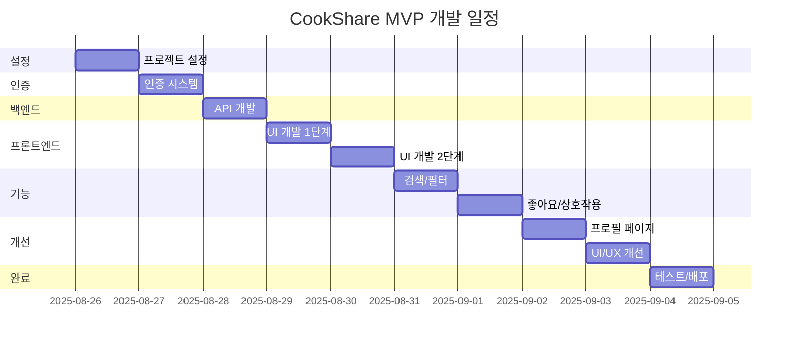

# CookShare MVP - Work Breakdown Structure (WBS)

## 프로젝트 개요
- **프로젝트명**: CookShare MVP
- **총 기간**: 10일 (2주)
- **개발 인원**: 1-2명
- **목표**: 로컬 환경에서 동작하는 레시피 공유 서비스 프로토타입

## WBS 레벨 구조

### Level 1: 주요 단계 (Phase)
```
1. 프로젝트 설정 및 환경 구성 (Day 1)
2. 인증 시스템 구현 (Day 2) 
3. 백엔드 API 개발 (Day 3)
4. 프론트엔드 UI 개발 (Day 4-5)
5. 검색 및 상호작용 기능 (Day 6-7)
6. 프로필 및 UI 개선 (Day 8-9)
7. 테스트 및 최적화 (Day 10)
```

## 상세 작업 분해 구조

### 1. 프로젝트 설정 및 환경 구성 (Day 1)
**소요시간**: 8시간 | **담당**: 개발자 1명

#### 1.1 프로젝트 초기화 (2시간)
- **1.1.1** Next.js 프로젝트 생성
  - `npx create-next-app@latest cookshare-mvp --typescript --tailwind --app`
  - 기본 설정 확인 및 커스터마이징
  - **산출물**: 초기 프로젝트 구조

- **1.1.2** 필수 패키지 설치
  - Prisma, NextAuth, shadcn/ui, Zod 설치
  - 개발 도구 설정 (ESLint, Prettier)
  - **산출물**: package.json, 설정 파일들

#### 1.2 데이터베이스 설정 (3시간)
- **1.2.1** Prisma 초기화 및 스키마 작성
  - SQLite 데이터소스 설정
  - User, Recipe, Ingredient, Step, Like 모델 정의
  - **산출물**: schema.prisma

- **1.2.2** 데이터베이스 마이그레이션
  - 초기 마이그레이션 실행
  - Prisma Client 생성
  - **산출물**: 마이그레이션 파일, dev.db

- **1.2.3** 시드 데이터 작성
  - 테스트 사용자 및 레시피 데이터
  - 시드 스크립트 작성 및 실행
  - **산출물**: seed.ts, 테스트 데이터

#### 1.3 기본 레이아웃 구성 (3시간)
- **1.3.1** 공통 컴포넌트 설치
  - shadcn/ui 컴포넌트 설치
  - Button, Input, Card 등 기본 UI
  - **산출물**: components/ui/

- **1.3.2** 레이아웃 컴포넌트 작성
  - Header, Footer, MainLayout
  - 네비게이션 메뉴 구성
  - **산출물**: components/layout/

- **1.3.3** 글로벌 스타일 설정
  - Tailwind 설정 커스터마이징
  - 색상 팔레트, 폰트 정의
  - **산출물**: tailwind.config.ts, globals.css

---

### 2. 인증 시스템 구현 (Day 2)
**소요시간**: 8시간 | **담당**: 개발자 1명

#### 2.1 NextAuth 설정 (3시간)
- **2.1.1** NextAuth 기본 설정
  - NextAuth.js 설정 파일 생성
  - Credentials Provider 구성
  - JWT 및 세션 설정
  - **산출물**: lib/auth.ts, [...nextauth]/route.ts

- **2.1.2** 환경 변수 설정
  - NEXTAUTH_SECRET, NEXTAUTH_URL 설정
  - 보안 키 생성
  - **산출물**: .env.local

#### 2.2 회원가입 기능 (2.5시간)
- **2.2.1** 회원가입 API
  - 사용자 등록 API Route
  - 비밀번호 해싱 (bcrypt)
  - 입력값 검증 (Zod)
  - **산출물**: api/auth/register/route.ts

- **2.2.2** 회원가입 UI
  - 회원가입 폼 컴포넌트
  - 폼 검증 및 에러 처리
  - **산출물**: app/(auth)/register/page.tsx

#### 2.3 로그인 기능 (2.5시간)
- **2.3.1** 로그인 API
  - Credentials Provider 구현
  - 사용자 인증 로직
  - **산출물**: 인증 로직 완성

- **2.3.2** 로그인 UI
  - 로그인 폼 컴포넌트
  - 세션 상태 관리
  - 리다이렉트 처리
  - **산출물**: app/(auth)/login/page.tsx

---

### 3. 백엔드 API 개발 (Day 3)
**소요시간**: 8시간 | **담당**: 개발자 1명

#### 3.1 레시피 CRUD API (5시간)
- **3.1.1** 레시피 생성 API (1.5시간)
  - POST /api/recipes
  - 입력값 검증 및 데이터 저장
  - 재료, 조리과정 관계형 데이터 처리
  - **산출물**: api/recipes/route.ts (POST)

- **3.1.2** 레시피 목록 조회 API (1.5시간)
  - GET /api/recipes
  - 검색, 필터, 정렬 기능
  - 페이지네이션 구현
  - **산출물**: api/recipes/route.ts (GET)

- **3.1.3** 레시피 상세 조회 API (1시간)
  - GET /api/recipes/[id]
  - 조회수 증가 로직
  - 작성자, 좋아요 정보 포함
  - **산출물**: api/recipes/[id]/route.ts (GET)

- **3.1.4** 레시피 수정/삭제 API (1시간)
  - PUT /api/recipes/[id] (수정)
  - DELETE /api/recipes/[id] (삭제)
  - 권한 검증 (작성자만)
  - **산출물**: api/recipes/[id]/route.ts (PUT, DELETE)

#### 3.2 파일 업로드 API (2시간)
- **3.2.1** 이미지 업로드 처리
  - POST /api/upload
  - 파일 크기, 확장자 검증
  - 로컬 파일 시스템 저장
  - **산출물**: api/upload/route.ts

- **3.2.2** 이미지 최적화
  - 이미지 리사이징
  - WebP 포맷 변환
  - **산출물**: 이미지 처리 유틸리티

#### 3.3 좋아요 API (1시간)
- **3.3.1** 좋아요 토글 API
  - POST /api/recipes/[id]/like
  - 좋아요 추가/제거 로직
  - 중복 처리 방지
  - **산출물**: api/recipes/[id]/like/route.ts

---

### 4. 프론트엔드 UI 개발 1단계 (Day 4)
**소요시간**: 8시간 | **담당**: 개발자 1명

#### 4.1 홈페이지 구현 (2시간)
- **4.1.1** 메인 페이지 레이아웃
  - 인기 레시피 표시
  - 최신 레시피 목록
  - **산출물**: app/page.tsx

- **4.1.2** 네비게이션 개선
  - 로그인 상태에 따른 메뉴 변경
  - 반응형 네비게이션
  - **산출물**: components/layout/Header.tsx

#### 4.2 레시피 목록 페이지 (3시간)
- **4.2.1** 레시피 카드 컴포넌트
  - 이미지, 제목, 간단 정보 표시
  - 좋아요, 조회수 표시
  - **산출물**: components/recipe/RecipeCard.tsx

- **4.2.2** 레시피 목록 컴포넌트
  - 그리드 레이아웃
  - 로딩 상태 처리
  - **산출물**: components/recipe/RecipeList.tsx

- **4.2.3** 목록 페이지 구성
  - API 연동
  - 무한 스크롤 또는 페이지네이션
  - **산출물**: app/recipes/page.tsx

#### 4.3 레시피 상세 페이지 (3시간)
- **4.3.1** 상세 정보 표시
  - 레시피 정보, 재료, 조리과정
  - 작성자 정보
  - **산출물**: components/recipe/RecipeDetail.tsx

- **4.3.2** 상호작용 기능
  - 좋아요 버튼
  - 조회수 표시
  - **산출물**: 상호작용 컴포넌트들

- **4.3.3** 상세 페이지 구성
  - API 연동
  - SEO 최적화 (메타데이터)
  - **산출물**: app/recipes/[id]/page.tsx

---

### 5. 프론트엔드 UI 개발 2단계 (Day 5)
**소요시간**: 8시간 | **담당**: 개발자 1명

#### 5.1 레시피 작성 페이지 (4시간)
- **5.1.1** 레시피 폼 컴포넌트 (2.5시간)
  - 제목, 설명, 카테고리 입력
  - 난이도, 조리시간, 인분 설정
  - **산출물**: components/recipe/RecipeForm.tsx

- **5.1.2** 동적 입력 필드 (1시간)
  - 재료 목록 동적 추가/제거
  - 조리과정 단계 관리
  - **산출물**: 동적 폼 컴포넌트

- **5.1.3** 이미지 업로드 (0.5시간)
  - 드래그앤드롭 이미지 업로드
  - 이미지 미리보기
  - **산출물**: 이미지 업로드 컴포넌트

#### 5.2 레시피 수정 페이지 (2시간)
- **5.2.1** 수정 폼 구현
  - 기존 데이터로 폼 초기화
  - 수정 권한 확인
  - **산출물**: app/recipes/[id]/edit/page.tsx

- **5.2.2** 삭제 기능
  - 삭제 확인 모달
  - 삭제 후 리다이렉트
  - **산출물**: 삭제 기능 구현

#### 5.3 폼 검증 및 에러 처리 (2시간)
- **5.3.1** 클라이언트 사이드 검증
  - Zod 스키마 활용
  - 실시간 검증 피드백
  - **산출물**: 폼 검증 로직

- **5.3.2** 에러 처리
  - API 에러 처리
  - 사용자 친화적 에러 메시지
  - **산출물**: 에러 처리 컴포넌트

---

### 6. 검색 및 필터 기능 (Day 6)
**소요시간**: 8시간 | **담당**: 개발자 1명

#### 6.1 검색 기능 구현 (4시간)
- **6.1.1** 검색 API 개선 (1.5시간)
  - 제목 기반 검색
  - 검색어 하이라이팅
  - **산출물**: 개선된 검색 API

- **6.1.2** 검색 UI 컴포넌트 (1.5시간)
  - 검색바 컴포넌트
  - 검색 결과 표시
  - **산출물**: components/recipe/SearchBar.tsx

- **6.1.3** 검색 페이지 (1시간)
  - 검색 결과 페이지
  - 검색어 유지
  - **산출물**: app/search/page.tsx

#### 6.2 필터링 시스템 (4시간)
- **6.2.1** 카테고리 필터 (1.5시간)
  - 카테고리별 필터링
  - 카테고리 선택 UI
  - **산출물**: 카테고리 필터 컴포넌트

- **6.2.2** 정렬 기능 (1시간)
  - 최신순, 인기순, 조회수순
  - 정렬 옵션 UI
  - **산출물**: 정렬 컴포넌트

- **6.2.3** 필터 조합 (1.5시간)
  - 다중 필터 적용
  - URL 쿼리 파라미터 관리
  - **산출물**: 통합 필터 시스템

---

### 7. 좋아요 및 상호작용 (Day 7)
**소요시간**: 8시간 | **담당**: 개발자 1명

#### 7.1 좋아요 시스템 완성 (4시간)
- **7.1.1** 좋아요 버튼 컴포넌트 (2시간)
  - 하트 아이콘 애니메이션
  - 좋아요 상태 표시
  - **산출물**: components/recipe/LikeButton.tsx

- **7.1.2** 좋아요 기능 통합 (2시간)
  - 레시피 카드에 좋아요 버튼
  - 실시간 좋아요 수 업데이트
  - **산출물**: 통합된 좋아요 시스템

#### 7.2 사용자 경험 개선 (4시간)
- **7.2.1** 로딩 상태 개선 (1.5시간)
  - 스켈레톤 로더
  - 버튼 로딩 상태
  - **산출물**: 로딩 컴포넌트들

- **7.2.2** 토스트 알림 (1시간)
  - 성공/에러 토스트
  - 사용자 피드백 개선
  - **산출물**: 토스트 시스템

- **7.2.3** 모바일 반응형 (1.5시간)
  - 모바일 레이아웃 최적화
  - 터치 인터페이스 개선
  - **산출물**: 반응형 스타일

---

### 8. 프로필 페이지 (Day 8)
**소요시간**: 8시간 | **담당**: 개발자 1명

#### 8.1 프로필 조회 (4시간)
- **8.1.1** 프로필 API (1시간)
  - 사용자 정보 조회 API
  - 작성한 레시피 목록 API
  - **산출물**: api/users/[id]/route.ts

- **8.1.2** 프로필 페이지 UI (3시간)
  - 사용자 정보 표시
  - 작성한 레시피 목록
  - 통계 정보 (레시피 수, 받은 좋아요 수)
  - **산출물**: app/profile/page.tsx

#### 8.2 프로필 수정 (4시간)
- **8.2.1** 프로필 수정 API (1시간)
  - 닉네임, 자기소개 수정
  - 프로필 이미지 업로드
  - **산출물**: 프로필 수정 API

- **8.2.2** 프로필 수정 UI (3시간)
  - 프로필 편집 폼
  - 이미지 업로드 기능
  - **산출물**: 프로필 수정 페이지

---

### 9. UI/UX 개선 및 최적화 (Day 9)
**소요시간**: 8시간 | **담당**: 개발자 1명

#### 9.1 디자인 개선 (4시간)
- **9.1.1** 색상 및 테마 (1.5시간)
  - 일관된 색상 팔레트
  - 다크 모드 준비
  - **산출물**: 개선된 디자인 시스템

- **9.1.2** 타이포그래피 및 간격 (1시간)
  - 일관된 폰트 사이즈
  - 적절한 여백과 간격
  - **산출물**: 타이포그래피 가이드

- **9.1.3** 마이크로 인터랙션 (1.5시간)
  - 버튼 호버 효과
  - 페이지 전환 애니메이션
  - **산출물**: 인터랙션 개선

#### 9.2 성능 최적화 (4시간)
- **9.2.1** 이미지 최적화 (2시간)
  - next/image 적용
  - 이미지 lazy loading
  - **산출물**: 최적화된 이미지

- **9.2.2** 코드 스플리팅 (1시간)
  - 동적 import 적용
  - 번들 크기 최적화
  - **산출물**: 최적화된 번들

- **9.2.3** SEO 최적화 (1시간)
  - 메타데이터 설정
  - sitemap.xml 생성
  - **산출물**: SEO 최적화

---

### 10. 테스트 및 배포 준비 (Day 10)
**소요시간**: 8시간 | **담당**: 개발자 1명

#### 10.1 기능 테스트 (4시간)
- **10.1.1** 수동 테스트 (2시간)
  - 전체 기능 시나리오 테스트
  - 브라우저 호환성 테스트
  - **산출물**: 테스트 결과 리포트

- **10.1.2** 버그 수정 (2시간)
  - 발견된 버그 수정
  - 에러 처리 개선
  - **산출물**: 버그 수정 완료

#### 10.2 문서화 (2시간)
- **10.2.1** README 작성
  - 프로젝트 설명
  - 설치 및 실행 방법
  - **산출물**: README.md

- **10.2.2** API 문서 작성
  - API 엔드포인트 정리
  - 사용 예시
  - **산출물**: API_DOCS.md

#### 10.3 배포 준비 (2시간)
- **10.3.1** 빌드 테스트
  - 프로덕션 빌드 실행
  - 빌드 오류 수정
  - **산출물**: 성공적인 빌드

- **10.3.2** 환경 변수 정리
  - 프로덕션 환경 변수 가이드
  - 보안 설정 확인
  - **산출물**: 배포 가이드

---

## 의존성 관계도



## 위험 요소 및 대응 방안

### 기술적 위험
1. **NextAuth 설정 복잡성**
   - **위험도**: 중간
   - **대응**: 공식 문서 숙지, 예제 코드 활용
   - **완화**: 간단한 Credentials Provider부터 시작

2. **Prisma 스키마 설계 오류**
   - **위험도**: 높음
   - **대응**: 마이그레이션 전 스키마 검토, 백업 유지
   - **완화**: 단계적 스키마 구축

3. **이미지 업로드 처리**
   - **위험도**: 중간
   - **대응**: 파일 크기 제한, 확장자 검증
   - **완화**: multer 대신 Next.js API 활용

### 일정 위험
1. **UI 개발 지연**
   - **위험도**: 중간
   - **대응**: shadcn/ui 활용으로 시간 단축
   - **완화**: 필수 기능 우선 구현

2. **통합 테스트 시간 부족**
   - **위험도**: 높음
   - **대응**: 개발 중 지속적 테스트
   - **완화**: 핵심 기능 우선 테스트

## 산출물 체크리스트

### Day 1 체크리스트
- [ ] Next.js 프로젝트 생성 완료
- [ ] 필수 패키지 설치 완료
- [ ] Prisma 스키마 작성 완료
- [ ] 데이터베이스 마이그레이션 완료
- [ ] 시드 데이터 생성 완료
- [ ] 기본 레이아웃 컴포넌트 완료
- [ ] shadcn/ui 컴포넌트 설치 완료

### Day 2 체크리스트
- [ ] NextAuth 설정 완료
- [ ] 회원가입 API 완료
- [ ] 로그인 API 완료
- [ ] 회원가입 UI 완료
- [ ] 로그인 UI 완료
- [ ] 세션 관리 완료

### Day 3 체크리스트
- [ ] 레시피 생성 API 완료
- [ ] 레시피 목록 조회 API 완료
- [ ] 레시피 상세 조회 API 완료
- [ ] 레시피 수정/삭제 API 완료
- [ ] 이미지 업로드 API 완료
- [ ] 좋아요 API 완료

### Day 4 체크리스트
- [ ] 홈페이지 완료
- [ ] 레시피 카드 컴포넌트 완료
- [ ] 레시피 목록 페이지 완료
- [ ] 레시피 상세 페이지 완료
- [ ] API 연동 완료

### Day 5 체크리스트
- [ ] 레시피 작성 폼 완료
- [ ] 레시피 수정 페이지 완료
- [ ] 이미지 업로드 UI 완료
- [ ] 폼 검증 및 에러 처리 완료

### Day 6 체크리스트
- [ ] 검색 기능 완료
- [ ] 카테고리 필터 완료
- [ ] 정렬 기능 완료
- [ ] 검색 페이지 완료

### Day 7 체크리스트
- [ ] 좋아요 버튼 컴포넌트 완료
- [ ] 좋아요 기능 통합 완료
- [ ] 로딩 상태 개선 완료
- [ ] 토스트 알림 완료
- [ ] 모바일 반응형 완료

### Day 8 체크리스트
- [ ] 프로필 조회 API 완료
- [ ] 프로필 페이지 UI 완료
- [ ] 프로필 수정 API 완료
- [ ] 프로필 수정 UI 완료

### Day 9 체크리스트
- [ ] 디자인 시스템 개선 완료
- [ ] 이미지 최적화 완료
- [ ] 코드 스플리팅 완료
- [ ] SEO 최적화 완료

### Day 10 체크리스트
- [ ] 전체 기능 테스트 완료
- [ ] 버그 수정 완료
- [ ] README 작성 완료
- [ ] API 문서 작성 완료
- [ ] 빌드 테스트 완료
- [ ] 배포 가이드 완료

## 품질 관리

### 코드 리뷰
- 매일 작업 완료 후 셀프 코드 리뷰
- TypeScript 엄격 모드 사용
- ESLint/Prettier 자동 검사

### 테스트 전략
- 주요 API 엔드포인트 수동 테스트
- 브라우저 호환성 테스트 (Chrome, Safari, Firefox)
- 모바일 반응형 테스트

### 성능 기준
- 페이지 로딩 시간 3초 이내
- 이미지 최적화 적용
- Core Web Vitals 준수

---

작성일: 2025-08-23
버전: 1.0.0